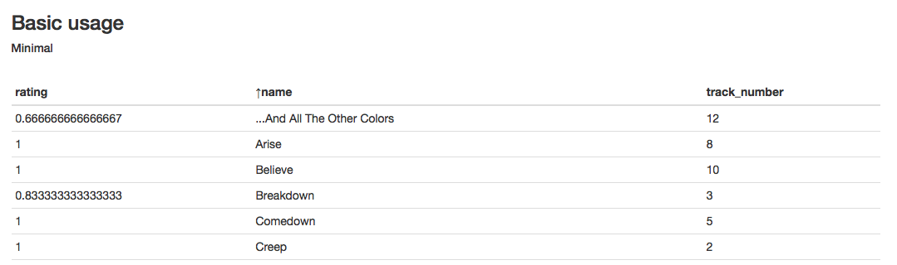
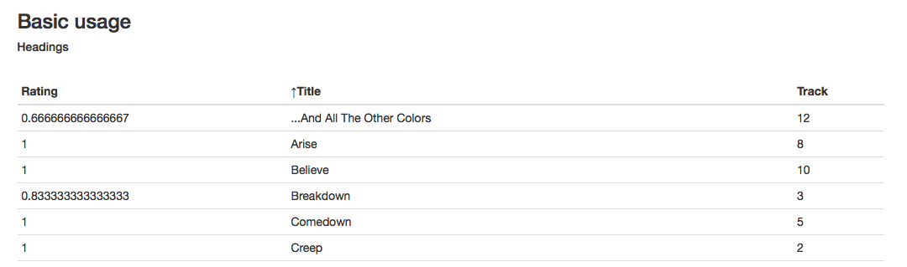
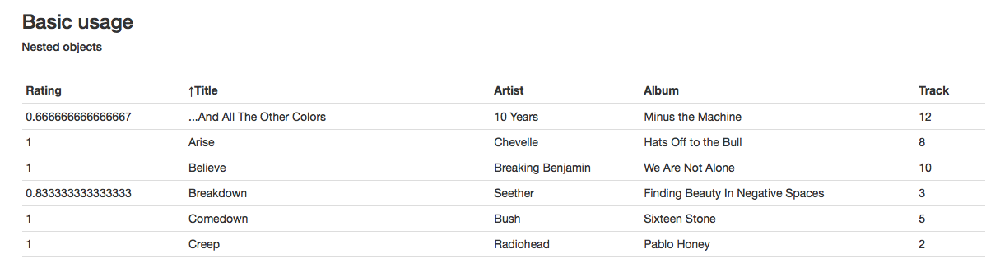
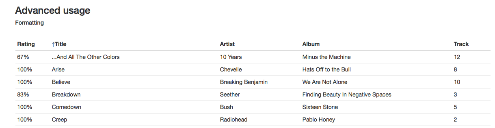
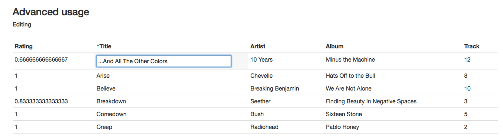
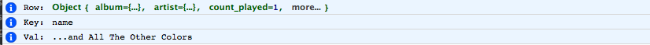
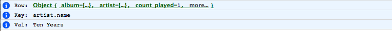

# react-smallgrid
A datatable for react (bootstrap themed)

Features: pagination, ordering, formatting, editing

### Installation

Install via npm:
   
    npm install react-smallgrid
    
    
#### Dependencies

- React
- Lodash

Optionally [bootstrap](https://getbootstrap.com) class names are used. Can overwrite same
class names in your own stylesheet. Otherwise, it is unstyled.

### Usage

    import SmallGrid from 'react-smallgrid';
    

## Basic Usage
---

### Foreword

The table can only be ordered by one column; I'll probably add it to support multiple
columns in the future.

The table is hardcoded with pagination. Currently the row limit/page size is hardcoded at 20. I'll
probably change it in the future, and you can also easily change it.

### Minimal

SmallGrid has two required attributes:

- __rows__ an array of objects (the data)
- __cols__: an array of objects (the columns)

The `cols` attribute has the following required property for the objects:

- __key__: the property/key on the data

        <SmallGrid
            rows={props.rows}
            cols={[
                {'key': 'rating'},
                {'key': 'name'},
                {'key': 'track_number'},
            ]}
        />
    
[refer example](examples/1_basic_minimal.html)

 
### Column headings

Add the property `name` to the cols objects for the heading of the columns:

            <SmallGrid
                rows={this.state.rows}
                cols={[
                    {'key': 'rating',       'name': 'Rating'},
                    {'key': 'name',         'name': 'Title'},
                    {'key': 'track_number', 'name': 'Track'},
                ]}
            />

[refer example](examples/2_basic_headings.html)

### Nested objects

Add the nested object to the `key` of the columns:

            <SmallGrid
                rows={this.state.rows}
                cols={[
                    {'key': 'rating',       'name': 'Rating'},
                    {'key': 'name',         'name': 'Title'},
                    {'key': 'artist.name',  'name': 'Artist'},
                    {'key': 'album.name',   'name': 'Album'},
                    {'key': 'track_number', 'name': 'Track'},
                ]}
            />

[refer example](examples/3_basic_nested_objects.html)

## Advanced Usage
---

### Formatting

You can pass `format` function on the `cols` object for the formatting you wish to apply to the column:

    formatPercentage: function (v) {
        return Math.round(v * 100) + '%';
    },

    ...
    
            <SmallGrid
                rows={this.state.rows}
                cols={[
                    {'key': 'rating',       'name': 'Rating', 'format': this.formatPercentage},
                    {'key': 'name',         'name': 'Title'},
                    {'key': 'artist.name',  'name': 'Artist'},
                    {'key': 'album.name',   'name': 'Album'},
                    {'key': 'track_number', 'name': 'Track'},
                ]}
            />

[refer example](examples/4_advanced_formatting.html)

### Editing

You can pass `edit` function on the `cols` object to enable editing on that column. 'Enter' will
submit the changes and 'esc' will cancel the edit. If the value is the same, the propagation
will also be stopped. The function provided to edit will then receive three params:

- __row__: the complete row object from the data (unchanged)
- __key__: the key/property of the row that was changed
- __val__: the new value for the property that was submitted

        onEdit: function (row, key, val) {
            console.info('Row: ', row);
            console.info('Key: ', key);
            console.info('Val: ', val);
            // send update to backend
        },
    
        ...
    
            <SmallGrid
                rows={this.state.rows}
                cols={[
                    {'key': 'rating',       'name': 'Rating'},
                    {'key': 'name',         'name': 'Title',  'edit': this.onEdit},
                    {'key': 'artist.name',  'name': 'Artist', 'edit': this.onEdit},
                    {'key': 'album.name',   'name': 'Album'},
                    {'key': 'track_number', 'name': 'Track'},
                ]}
            />

[refer example](examples/5_advanced_editing.html)

